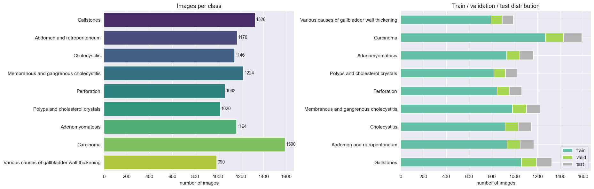
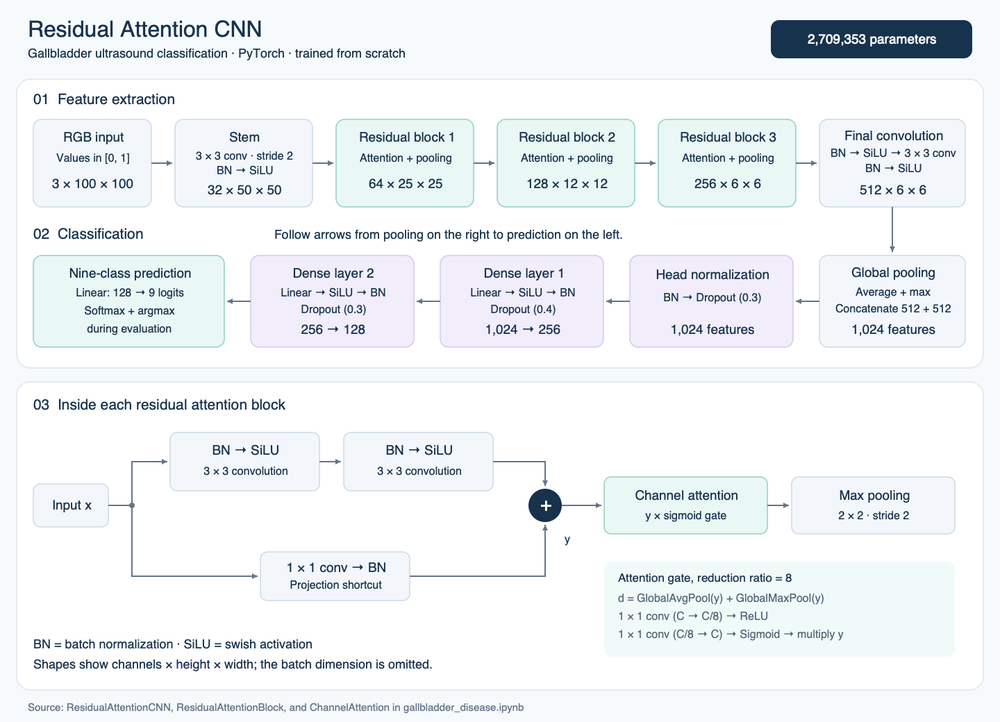
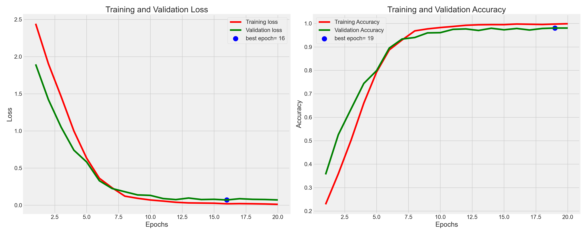
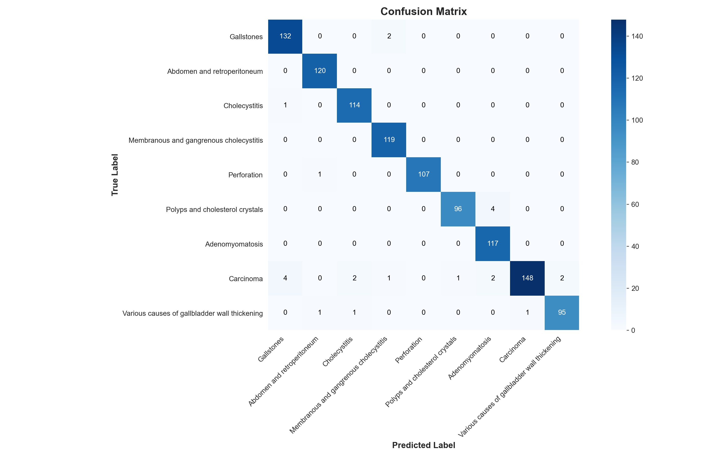
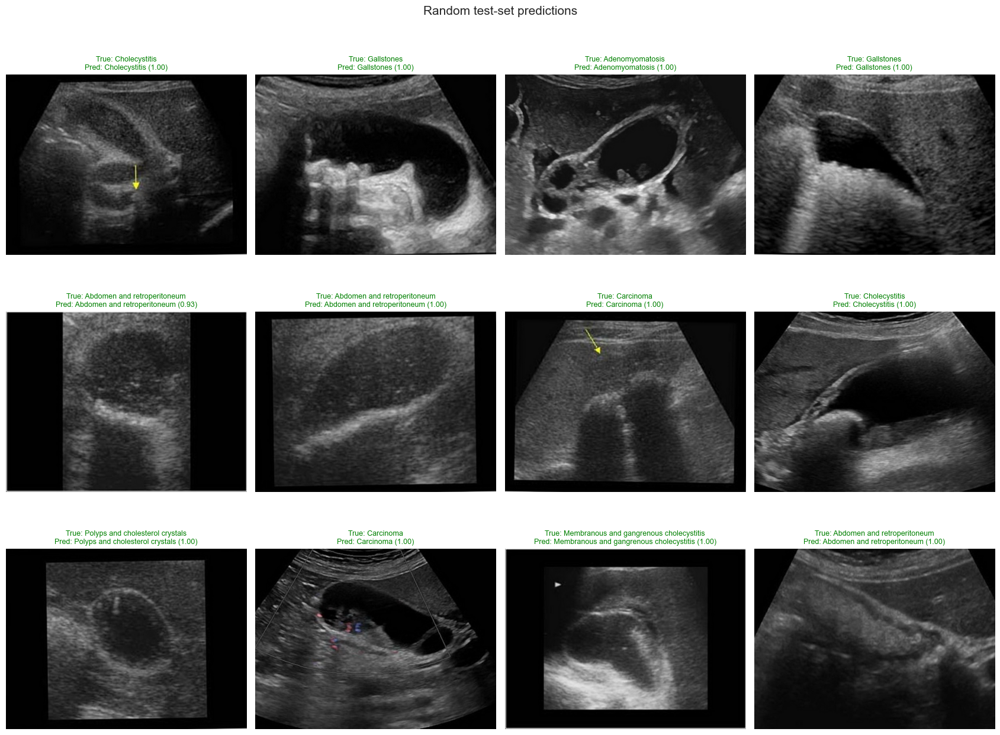

# Gallbladder Disease Classification

A PyTorch project that classifies ultrasound images into **nine gallbladder condition classes** using a custom **Residual Attention CNN**.

[Notebook](gallbladder_disease.ipynb) · [Project report](Gallbladder%20Disease%20Classification%20Report.docx.pdf) · [Dataset](https://data.mendeley.com/datasets/r6h24d2d3y/2)

## Dataset

Source: [Gallblader Diseases Dataset, version 2](https://data.mendeley.com/datasets/r6h24d2d3y/2), with **10,692 ultrasound images** in nine class folders.

| Training | Validation | Test |
| ---: | ---: | ---: |
| 8,554 images | 1,067 images | 1,071 images |

The **80% / 10% / 10%** split uses seed `123`. Images sharing a 256-bit average hash stay together; groups are stratified by majority class. Inputs use **RGB, 100 × 100 pixels, and [0, 1] scaling**, with no additional training augmentation.



## Model architecture

Trained from scratch, the model has **2,709,353 parameters**. Three residual blocks use channel attention, followed by combined global average/max pooling and a dense classifier.



The model uses SiLU, batch normalization, and dropout. Evaluation applies softmax to nine logits, then selects the highest-scoring class. [Editable diagram](assets/model_architecture.svg).

## Training

| Setting | Value |
| --- | --- |
| Epochs / batch size | 20 / 32 |
| Optimizer | Adamax |
| Initial learning rate | 0.001 |
| Loss | Cross-entropy + L2 penalty on the two hidden dense-layer weights |
| L2 coefficient | 0.0001 |
| Learning rate schedule | Multiply by `exp(-0.1)` at each epoch's start; reduce on a validation-loss plateau |
| Plateau settings | Factor 0.2, patience 5, reduction floor 0.0001 |

The best validation-accuracy checkpoint is saved, but recorded results use **epoch 20 weights** (`RESTORE_BEST = False`). Training uses no early stopping or mixed precision.



## Results

Results from the notebook's saved run:

| Metric | Result |
| --- | ---: |
| Training accuracy, evaluated after training | 99.99% |
| Validation accuracy | 98.03% |
| Test accuracy | **97.85%** |
| Test macro precision | 97.89% |
| Test macro recall | 98.02% |
| Test macro F1 | **97.93%** |
| Test macro ROC AUC, one-vs-rest | 0.9997 |

**1,048 / 1,071 test images** were correct. Carcinoma had the lowest recall: **92.50%**. See the notebook for the full classification report. Training curves use training mode; table scores use evaluation mode.

**Evaluation limit:** matching hashes do not prove patient separation. Related or augmented images with different hashes may cross splits and inflate scores. Unseen-patient performance needs a verified patient-level split and external evaluation.



[ROC curves](outputs/roc_curve.png) · [Precision–recall curves](outputs/pr_curve.png) · [Training history](outputs/training_history.csv)

### Sample predictions

Exported from the saved notebook output. Green means correct; red means incorrect.



## Run the notebook

1. Download and extract the [dataset](https://data.mendeley.com/datasets/r6h24d2d3y/2), keeping its class folders intact.
2. Install the dependencies in a Python environment:

   ```bash
   pip install torch torchvision numpy pandas matplotlib seaborn pillow scikit-learn notebook
   jupyter notebook gallbladder_disease.ipynb
   ```

3. Update the Windows-specific `DATA_DIR`. For a dataset folder beside the notebook:

   ```python
   DATA_DIR = Path("Gallblader Diseases Dataset")
   ```

4. Run cells in order. The notebook uses CUDA if available, otherwise CPU. If multiprocessing fails, set `NUM_WORKERS = 0`.

For Colab, upload the notebook, mount Drive, and set `DATA_DIR` to your dataset folder. Copy `outputs/` to Drive to keep results.

Recorded environment: **Python 3.10, PyTorch 2.1.0 + CUDA 12.1, NVIDIA GTX 1650**; about **25 minutes**. Runtime and results depend on hardware, library versions, and data order.

## Files

```text
gallbladder_disease.ipynb                         Main notebook with saved outputs
Gallbladder Disease Classification Report.pdf   report
assets/                                         Architecture and exported notebook figures
outputs/                                        Training history and evaluation plots
README.md                                       Project overview and setup
```

`.gitignore` excludes the dataset and generated weights. Training saves `outputs/best_model.pt` and `outputs/gallbladder_resattn_cnn.pt`; the latter includes class names and input size.

## Dataset credit

Turki, A.; Obaid, A. M.; Bellaaj, H.; Ksantini, M.; Altaee, A. (2024). *Gallblader Diseases Dataset*, version 2. Mendeley Data. [doi:10.17632/r6h24d2d3y.2](https://doi.org/10.17632/r6h24d2d3y.2).

The dataset is published under **CC BY 4.0**. Sample-image figures use images from that dataset. This is an educational project, not a clinically validated diagnostic tool.
